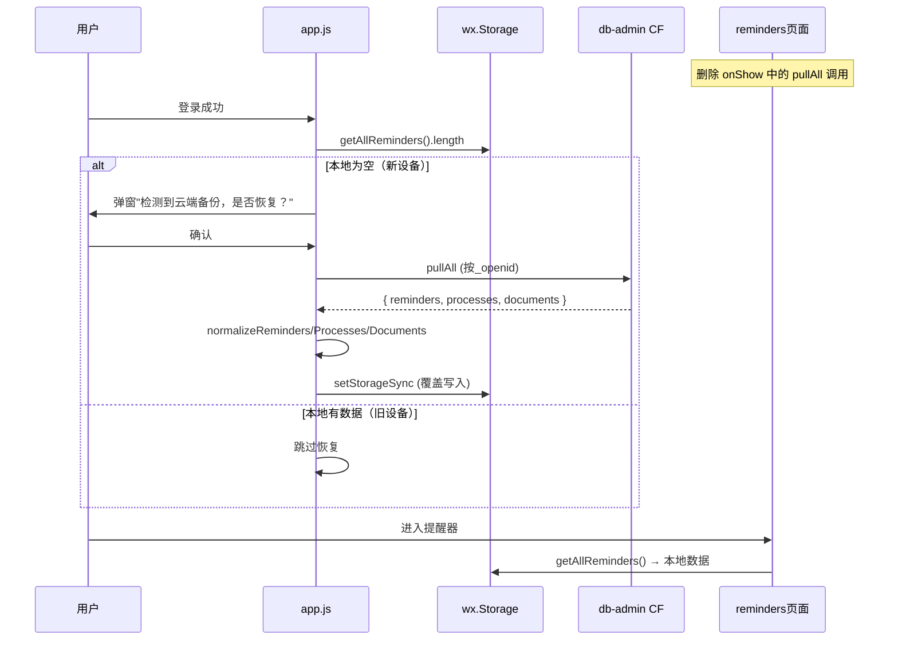

# 技术设计文档 (TDD) — R4 存储架构 v4

## 文档信息
- 版本：v1.0
- 日期：2026-05-28
- 关联 PRD：PRD_STORAGE_ARCHITECTURE_V4.md v1.1
- 关联评审：PRD_REVIEW_R4.md（5 条件已纳入）

## 1. 概述

### 1.1 背景
`reminders/index.js:428-449` 在每次 `onShow` 时尝试从云端合并提醒数据，但：
- 调用的 `reminder-engine.list` action 不存在，从未实际工作
- 云端与本地字段格式不兼容
- 合并逻辑破坏了本地优先的架构分层

### 1.2 设计思路
最小变更：删除死代码，复用已有 `db-admin.pullAll`，在 app.js 登录后一次性执行新设备恢复。不改 storage.js 读写接口。

### 1.3 非功能需求
| 维度 | 目标 |
|------|------|
| 性能 | 恢复逻辑仅首次登录执行一次，不影响日常使用 |
| 兼容 | 旧设备跳过恢复，行为与修复前一致 |
| 安全 | pullAll 增加字段白名单 |

## 2. 技术栈
无新增。复用现有：微信小程序原生 Page、CloudBase 云函数、wx.Storage。

## 3. 系统架构



## 4. 变更详情

### 4.1 删除：reminders/index.js line 428-449

**文件**: `pages/reminders/index/index.js`
**变更**: 删除 `loadReminders` 中的云端同步代码块
**影响**: 无。该代码从未实际工作（`reminder-engine` 无 `list` action），catch 已静默吞错。

### 4.2 修改：db-admin pullAll 字段白名单

**文件**: `cloudfunctions/db-admin/index.js`
**变更**: `pullAllData` 返回数据前做字段过滤

```javascript
// 新增白名单常量
const REMINDER_WHITELIST = ['_id','title','deadline','deadlineDate','description','status','type','confidence',
  'pathway','chainId','chainLabel','chainOrder','linkedDocIds','offsetDays','createdAt','updatedAt'];
const PROCESS_WHITELIST = ['_id','name','templateId','status','stages','completedStages','currentStageId',
  'createdAt','updatedAt'];
const DOCUMENT_WHITELIST = ['_id','name','type','category','number','expiryDate','issueDate','status',
  'createdAt','updatedAt'];

function filterFields(obj, whitelist) {
  const result = {};
  whitelist.forEach(k => { if (obj[k] !== undefined) result[k] = obj[k]; });
  return result;
}

// pullAllData 返回前过滤
return {
  code: 200,
  data: {
    documents: docsRes.data.map(d => filterFields(d, DOCUMENT_WHITELIST)),
    reminders: remindersRes.data.map(r => filterFields(r, REMINDER_WHITELIST)),
    processes: processesRes.data.map(p => filterFields(p, PROCESS_WHITELIST)),
  },
};
```

### 4.3 新增：app.js 新设备恢复逻辑

**文件**: `app.js`
**位置**: `onLaunch` 或登录成功回调中，`cloudReady` 之后

```javascript
// 引入 storage 模块（app.js 已引用）
const { getAllReminders, getAllProcessLines, getAllDocuments } = require('./utils/storage');

async function checkAndRestoreFromCloud() {
  if (!this.globalData.cloudReady || !this.globalData.isLoggedIn) return;

  const hasReminders = getAllReminders().length > 0;
  const hasProcesses = getAllProcessLines().length > 0;
  const hasDocuments = Object.keys(getAllDocuments()).length > 0;

  // 有任何本地数据 → 跳过，本地优先
  if (hasReminders || hasProcesses || hasDocuments) return;

  // 确认弹窗
  const confirmed = await new Promise(resolve => {
    wx.showModal({
      title: '数据恢复',
      content: '检测到云端有备份数据，是否恢复到当前设备？',
      confirmText: '恢复',
      cancelText: '暂不',
      success: res => resolve(res.confirm),
    });
  });
  if (!confirmed) return;

  try {
    const res = await wx.cloud.callFunction({ name: 'db-admin', data: { action: 'pullAll' } });
    if (res.result && res.result.code === 200 && res.result.data) {
      const d = res.result.data;
      if (d.reminders && d.reminders.length) {
        const normalized = d.reminders.map(normalizeReminder);
        wx.setStorageSync('__reminders__', normalized);
      }
      if (d.processes && d.processes.length) {
        const normalized = d.processes.map(normalizeProcess);
        wx.setStorageSync('__processes__', normalized);
      }
      if (d.documents && d.documents.length) {
        const docMap = {};
        d.documents.forEach(doc => { docMap[doc._id] = normalizeDocument(doc); });
        wx.setStorageSync('__vault_meta__', { documents: docMap, version: 1 });
      }
      wx.showToast({ title: '数据已恢复', icon: 'success' });
    }
  } catch (e) {
    console.warn('[restore] 云端恢复失败:', e);
  }
}

// 字段映射函数
function normalizeReminder(r) {
  return {
    id: r._id || r.id,
    title: r.title || '',
    deadline: r.deadline || r.deadlineDate || '',
    description: r.description || '',
    status: r.status === 'pending' ? 'active' : r.status || 'active',
    type: r.type || 'manual',
    confidence: r.confidence || 'B',
    pathway: r.pathway || null,
    chainId: r.chainId || null,
    chainLabel: r.chainLabel || null,
    chainOrder: r.chainOrder,
    linkedDocIds: r.linkedDocIds || [],
    offsetDays: r.offsetDays,
    createdAt: r.createdAt || new Date().toISOString(),
    updatedAt: r.updatedAt || new Date().toISOString(),
  };
}

function normalizeProcess(p) {
  return {
    id: p._id || p.id,
    name: p.name || '',
    templateId: p.templateId || '',
    status: p.status || 'active',
    stages: p.stages || [],
    completedStages: p.completedStages || [],
    currentStageId: p.currentStageId || '',
    createdAt: p.createdAt || new Date().toISOString(),
    updatedAt: p.updatedAt || new Date().toISOString(),
  };
}

function normalizeDocument(d) {
  return {
    id: d._id || d.id,
    name: d.name || '',
    type: d.type || '',
    category: d.category || '',
    number: d.number || '',
    expiryDate: d.expiryDate || null,
    issueDate: d.issueDate || null,
    status: d.status || 'active',
    createdAt: d.createdAt || new Date().toISOString(),
    updatedAt: d.updatedAt || new Date().toISOString(),
  };
}
```

## 5. 文件变更清单

| 文件 | 变更 | 行数 |
|------|------|:--:|
| pages/reminders/index/index.js | 删除 line 428-449 | -17 |
| cloudfunctions/db-admin/index.js | pullAllData 增加白名单过滤 | +25 |
| app.js | 新增 checkAndRestoreFromCloud + normalize 函数 | +90 |

## 6. 异常处理

| 异常 | 处理 |
|------|------|
| pullAll 超时 | catch 吞错，本地保持空，用户可正常使用 |
| pullAll 返回格式错误 | normalize 兜底（`r._id \|\| r.id`），不崩溃 |
| 用户取消恢复弹窗 | 跳过，本地保持空 |
| 已登录但 cloudReady=false | 跳过恢复，等待下次 onShow |
| 恢复后本地已写入，但 syncAllToCloud 在上传前触发 | 无影响，sync 是 upsert，云端数据会被覆盖为最新 |

## 7. 下游影响

| 模块 | 影响 | 说明 |
|------|:--:|------|
| 提醒器列表 | 无 | getAllReminders 接口不变 |
| 提醒详情 | 无 | 同上 |
| 流程控 | 无 | getAllProcessLines 接口不变 |
| 证件夹 | 无 | getAllDocuments 接口不变 |
| syncAllToCloud | 无 | 上传接口不变 |
| reminder-engine | 无 | 不再被 reminders 页面调用 |

---

## 8. 任务拆解

### Epic 概览
| Epic | 标题 | SP | 优先级 | 依赖 |
|------|------|:--:|:--:|------|
| EPIC-R4 | 存储架构 v4 落地 | 6 | P0 | — |

### T-001: 删除 reminders onShow 合并死代码
**SP**: 1 | **优先级**: P0 | **依赖**: 无
**文件**: `pages/reminders/index/index.js`
**验收标准**:
- [ ] line 428-449 已删除
- [ ] 提醒器页面 onShow 正常加载（无报错）
- [ ] node -c 通过

### T-002: db-admin pullAll 增加字段白名单
**SP**: 2 | **优先级**: P0 | **依赖**: 无
**文件**: `cloudfunctions/db-admin/index.js`
**验收标准**:
- [ ] 三个白名单常量已定义
- [ ] `filterFields` 函数正确过滤
- [ ] `phoneHash`、`passwordHash`、`openid` 不出现在返回结果中
- [ ] node -c 通过

### T-003: app.js 新增新设备恢复逻辑
**SP**: 3 | **优先级**: P0 | **依赖**: T-002
**文件**: `app.js`
**验收标准**:
- [ ] 逐域检测（任一非空 → 跳过）
- [ ] 恢复前弹窗确认
- [ ] normalize 字段映射正确
- [ ] 恢复失败不阻塞登录流程
- [ ] node -c 通过

### 依赖关系
```
T-001 ──┐
T-002 ──┼── T-003 ──→ 完成
```

---

## 8. 任务拆解

### Epic 概览
| Epic | 标题 | SP | 优先级 | 依赖 |
|------|------|:--:|:--:|------|
| EPIC-R4 | 存储架构 v4 落地 | 6 | P0 | — |

### T-001: 删除 reminders onShow 合并死代码
**SP**: 1 | **优先级**: P0 | **依赖**: 无
**文件**: `pages/reminders/index/index.js`
**验收标准**:
- [ ] line 428-449 已删除
- [ ] 提醒器页面 onShow 正常加载（无报错）
- [ ] node -c 通过

### T-002: db-admin pullAll 增加字段白名单
**SP**: 2 | **优先级**: P0 | **依赖**: 无
**文件**: `cloudfunctions/db-admin/index.js`
**验收标准**:
- [ ] 三个白名单常量已定义（提醒/流程/证件）
- [ ] `filterFields` 函数正确过滤
- [ ] `pullAllData` 返回数据经过白名单过滤
- [ ] `phoneHash`、`passwordHash`、`openid` 不出现在返回结果中
- [ ] node -c 通过

### T-003: app.js 新增新设备恢复逻辑
**SP**: 3 | **优先级**: P0 | **依赖**: T-002
**文件**: `app.js`
**验收标准**:
- [ ] `checkAndRestoreFromCloud` 在 cloudReady && isLoggedIn 后调用
- [ ] 逐域检测（提醒/流程/证件任一非空 → 跳过）
- [ ] 恢复前弹窗确认
- [ ] normalizeReminder/Process/Document 字段映射正确
- [ ] 恢复失败不阻塞登录流程
- [ ] node -c 通过

### 依赖关系
```
T-001 (删除死代码) ──┐
                      ├── T-003 (app.js 恢复) ──→ 完成
T-002 (白名单) ──────┘

---

## 附录A: 技术方案评审报告

### 预读问题

| # | 提问人 | 问题 | 回应 | 状态 |
|---|--------|------|------|:--:|
| 1 | 架构师 | 复用 pullAll 而非新建 restore，白名单是否影响现有调用方？ | pullAll 无前端调用方，白名单纯减法不破坏现有字段 | ✅ |
| 2 | 资深开发者 | normalize 中 `status: pending → active` 是否有语义偏差？ | 云端 pending 等价于本地 active（均未完成） | ✅ |
| 3 | 测试 | 恢复后 syncAllToCloud 是否重复上传？ | sync 是 upsert，不重复 | ✅ |

### 六维度评审

| 维度 | 结论 | 说明 |
|------|:--:|------|
| 合规性 | ✅ | 复用现有组件，无新依赖 |
| 可用性 | ✅ | 恢复失败不影响正常使用 |
| 扩展性 | ✅ | normalize 函数独立，后续可按域拆分 |
| 性能 | ✅ | 仅首次登录执行一次 |
| 安全性 | ✅ | 白名单过滤敏感字段，确认弹窗防静默覆盖 |
| 可观测性 | ✅ | console.warn 记录恢复失败 |

### 风险矩阵

| 风险 | 概率 | 影响 | 缓解 |
|------|:--:|:--:|------|
| pullAll 超时 | 低 | 低 | catch 吞错，下次登录重试 |
| 字段映射遗漏 | 低 | 中 | normalize 兜底值保护 |
| 旧设备误判 | 低 | 低 | 确认弹窗让用户选择 |

### 决议: ✅ 通过

| 角色 | 签字 |
|------|:--:|
| 架构师 | ✅ |
| 资深开发者 | ✅ |
| 测试agent | ✅ |
| 安全agent | ✅ |
``` |
