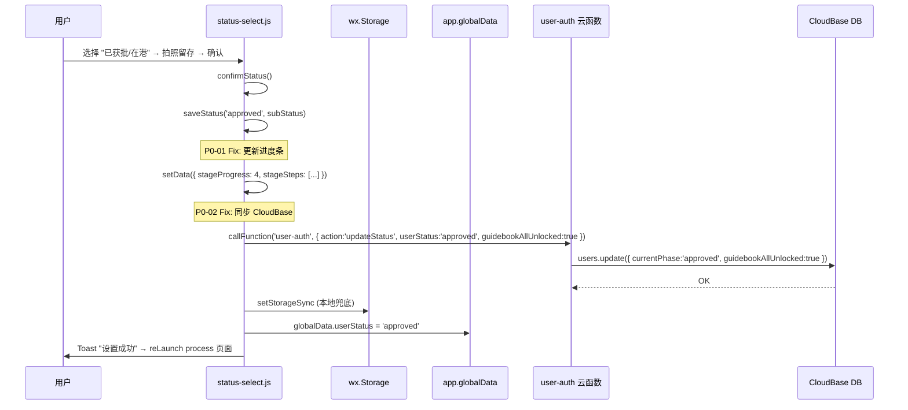
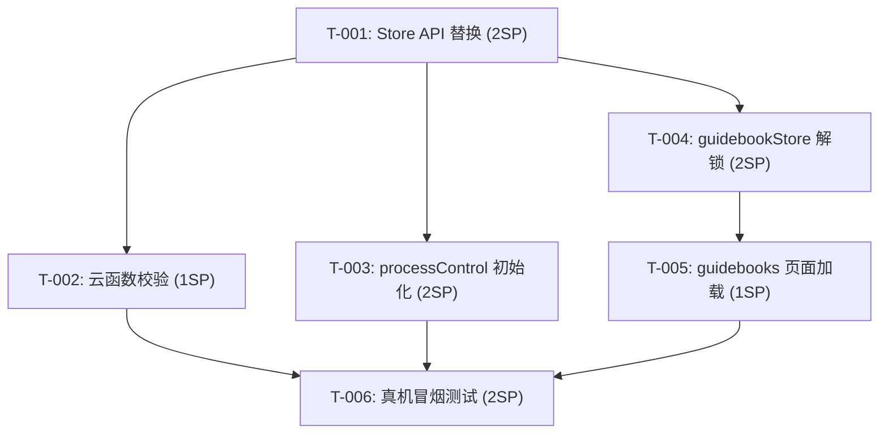

# 技术设计文档 (TDD) — ZGB-6B93CBC3 进度条+攻略书Bug修复

## 文档信息
- 项目：住港伴 ZGB V4
- 版本：v2.0（根因修正 — V4 微信原生代码，非 V1 Taro）
- 作者：项目技术开发人员agent
- 日期：2026-05-28
- 关联：Bug 排查报告 (DEPLOY_NOW.md 2026-05-28)

## 1. 概述

### 1.1 问题背景
用户通过邀请码 `ZGB-6B93CBC3` 注册后，在身份状态选择页面点击"已获批/在港(approved)"，但：
- 顶部进度条仍显示阶段 0（资格评估），未跳转到阶段 4（获批激活）
- 攻略书未全面解锁

线上数据确认：用户在 CloudBase `users` 中无记录（`saveStatus` 从未同步到后端）。

### 1.2 根因变更说明
**初始分析（v1.0）**错误地假设线上代码是 V1 的 `selectStatus/index.tsx`（Taro/React）。
**实际线上代码**是 V4 的 `pages/status-select/status-select.js`（微信原生 Page），根因完全不同。

### 1.3 设计思路
修复 `saveStatus` 方法的三个缺陷：

1. **进度条阶段未更新** — `stageProgress` 硬编码为 0，`__process_stage__` 已存但页面 data 未刷新
2. **状态未同步 CloudBase** — 纯本地存储（`wx.setStorageSync`），`users.currentPhase` 从未更新
3. **攻略书未解锁** — `guidebookAllUnlocked` 字段从未写入

### 1.4 非功能需求
| 维度 | 目标 |
|------|------|
| 兼容性 | 不影响现有已正常工作的用户数据 |
| 幂等性 | 重复选择相同状态不产生副作用 |
| 回滚方案 | 前端修复可独立回滚，云函数增量字段兼容旧调用方 |
| 非阻塞 | CloudBase 同步失败不阻断用户流程 |

## 2. 根因分析（v2.0 修正）

### 2.1 实际代码位置
`pages/status-select/status-select.js` — 微信原生 Page，非 Taro/React 组件。

### 2.2 三个缺陷

**P0-01: `stageProgress` 硬编码为 0**
```javascript
// data 初始化（line 36）
stageProgress: 0,   // ← 从未被 setData 更新

// saveStatus（line 227-229）
wx.setStorageSync('__process_stage__', targetStage);  // 存了本地
// ❌ 但没有 this.setData({ stageProgress: targetStage })
// ❌ 也没有 this.setData({ stageSteps: updatedSteps })
```
`stage-helper.js` 的 `getGlobalStages()` 能读到 `__process_stage__`，但 status-select 页面自身的 `stageProgress` 始终为 0，导致进度条组件 `<stage-indicator progress="{{stageProgress}}">` 始终显示阶段 0。

**P0-02: `saveStatus` 不同步 CloudBase**
```javascript
saveStatus: function (status, subStatus) {
  wx.setStorageSync(...);  // ✅ 本地存储
  app.globalData.userStatus = status;  // ✅ 内存
  // ❌ 没有 wx.cloud.callFunction('user-auth', { action: 'updateStatus' })
}
```
用户的 `currentPhase` 从未写入 CloudBase `users` 集合。

**P0-03: `guidebookAllUnlocked` 从未设置**
攻略书解锁由 `users.guidebookAllUnlocked` 控制，但 `saveStatus` 从未写入此字段。

## 3. 修复架构

### 3.1 涉及文件

| 文件 | 变更类型 | 说明 |
|------|----------|------|
| `pages/status-select/status-select.js` | 🔧 修改 | `saveStatus` 增加 `stageProgress`/`stageSteps` 更新 + CloudBase 同步 |
| `cloudfunctions/user-auth/index.js` | 🔧 修改 | `updateStatus` 增加 `guidebookAllUnlocked` 字段支持 |

### 3.2 数据流



### 3.3 关键代码变更

#### status-select.js: saveStatus 补全

```javascript
// P0-01: 更新页面进度条
var updatedSteps = that.data.stageSteps.map(function (step, idx) {
  if (idx < targetStage) return { ...step, status: 'completed' };
  if (idx === targetStage) return { ...step, status: 'active' };
  return { ...step, status: 'pending' };
});
that.setData({ stageProgress: targetStage, stageSteps: updatedSteps });

// P0-02 + P0-03: 同步 CloudBase + 攻略书解锁
wx.cloud.callFunction({
  name: 'user-auth',
  data: {
    action: 'updateStatus',
    userStatus: status,
    subStatus: subStatus,
    guidebookAllUnlocked: (status === 'approved' || status === 'permanent'),
  },
});
```

#### user-auth: updateStatus 扩展

```javascript
if (guidebookAllUnlocked !== undefined) {
  updateData.guidebookAllUnlocked = guidebookAllUnlocked;
}
```

## 4. 异常处理

| 异常场景 | 处理策略 | 用户感知 |
|----------|----------|----------|
| 云函数 `updateStatus` 超时 | 本地状态先更新，Toast 提示"网络延迟，状态稍后同步" | 进度条临时更新，刷新后校正 |
| `selectedPath` 为空 | 跳过 `initializeProcess`，仅更新状态和解锁攻略书 | 正常（用户可能尚未选择路径） |
| 重复选择相同状态 | 幂等：云函数 `updateStatus` 直接覆盖 | Toast "状态已确认" |
| `guidebookAllUnlocked` 写入失败 | `unlockByStatus` 本地更新先行，云函数异步；失败时下次 `loadGuidebooks` 重试 | 暂时全解锁，下次登录可能回退 |

## 5. 对下游影响分析

| 下游模块 | 影响 | 说明 |
|----------|:--:|------|
| 进度条 (processControl) | ✅ 修复 | `initializeProcess` 将正常触发 |
| 攻略书 (guidebookStore) | ➕ 新增 | 新增 `unlockByStatus` 方法 |
| 首页 Hero Card | ✅ 修复 | `userData.status` 正确后文案更新 |
| 续签仪表盘 | 🟢 无影响 | 仪表盘读 `user_profiles` 独立字段 |
| user-auth 云函数 | 🟢 无影响 | `updateStatus` 已支持 `approved` 值 |

## 6. 安全设计
- 状态更新通过 `user-auth` 云函数鉴权（wxContext.OPENID），无越权风险
- `STATUS_MAP` 仅做值映射，不引入新的状态枚举
- 攻略书解锁为**客户端增强**，服务端数据不变

## 7. 可观测性
- `confirmStatus` 增加 console.log 记录：状态值、云函数返回
- 攻略书解锁增加 try/catch + console.error
- 云函数侧 `updateStatus` 已有 `console.log('[user-auth] action:', action)`

## 9. 任务拆解

### Epic 概览
| Epic | 标题 | SP | 优先级 | 依赖 |
|------|------|:--:|:--:|------|
| EPIC-1 | 修复 selectStatus API 调用链 | 5 | P0 | - |
| EPIC-2 | 补全攻略书解锁逻辑 | 3 | P1 | EPIC-1 |
| EPIC-3 | 端到端验证 | 2 | P0 | EPIC-1, EPIC-2 |

### EPIC-1: 修复 selectStatus API 调用链 (5 SP)

#### T-001: 替换 selectStatus 的 Store API 调用
**SP**: 2 | **优先级**: P0 | **依赖**: 无
**描述**: 重写 `confirmStatus` 方法，使用 `useAuthStore` 替代不存在的 `useUserStore` 方法。
**变更文件**: `src/pages/auth/selectStatus/index.tsx`
**验收标准**:
- [ ] `confirmStatus` 调用 `authStore.updateUserStatus(status)` 而非 `updateUser()`
- [ ] 移除 `setIdentityStatus()` 调用
- [ ] `user?.pathway` 替换为 `userData?.selectedPath`
- [ ] 添加 `STATUS_MAP` 值映射：`'applied'→'submitted'`, `'permanent_resident'→'permanent'`
- [ ] TypeScript 编译零错误

#### T-002: 修复云函数状态校验链
**SP**: 1 | **优先级**: P0 | **依赖**: T-001
**描述**: 确认 `user-auth` 云函数 `updateStatus` 接受 `'approved'` 并写入 `currentPhase` 字段。
**变更文件**: `cloudfunctions/user-auth/index.js`
**验收标准**:
- [ ] `USER_STATUSES` 包含 `'approved'` ✓ (已确认)
- [ ] `updateStatus` 设置 `currentPhase: userStatus` ✓ (已确认)
- [ ] 增加 `guidebookAllUnlocked` 字段写入支持

#### T-003: 添加 processControl 初始化触发
**SP**: 2 | **优先级**: P0 | **依赖**: T-001
**描述**: 状态确认后正确触发 `processControlStore.initializeProcess()`。
**变更文件**: `src/pages/auth/selectStatus/index.tsx`
**验收标准**:
- [ ] `selectedPath` 不为空时正常调用 `initializeProcess`
- [ ] `selectedPath` 为空时跳过，不报错
- [ ] 进度条在状态确认后正确更新到对应阶段

### EPIC-2: 补全攻略书解锁逻辑 (3 SP)

#### T-004: guidebookStore 新增 unlockByStatus 方法
**SP**: 2 | **优先级**: P1 | **依赖**: T-001
**描述**: 新增 `unlockByStatus(status)` 方法，按用户状态控制攻略书解锁程度。
**变更文件**: `src/stores/guidebookStore.ts`
**验收标准**:
- [ ] `'approved'/'permanent_resident'` → `guidebookAllUnlocked: true`
- [ ] `'submitted'` → 解锁申请+激活阶段
- [ ] `'unapplied'` → 仅解锁评估阶段
- [ ] 同步写入 CloudBase（user-auth.updateStatus 扩展字段）

#### T-005: guidebooks 页面加载时检查解锁
**SP**: 1 | **优先级**: P1 | **依赖**: T-004
**描述**: 攻略书页面 `useEffect` 中读取 `userData.status` 并调用 `unlockByStatus`。
**变更文件**: `src/pages/guidebooks/index.tsx`
**验收标准**:
- [ ] 页面加载时自动调用 `guidebookStore.unlockByStatus(userData.status)`
- [ ] 刷新后解锁状态不丢失（读 CloudBase）

### EPIC-3: 端到端验证 (2 SP)

#### T-006: 真机冒烟测试
**SP**: 2 | **优先级**: P0 | **依赖**: T-001~T-005
**描述**: 用测试账号完整走通：登录→选择状态→确认→验证进度条更新+攻略书解锁。
**验收标准**:
- [ ] 选择"已获得身份" → 进度条正确更新到 approved 对应阶段
- [ ] 攻略书所有阶段 card 可点击进入（非灰色锁定态）
- [ ] 退出重登后状态保持
- [ ] CloudBase `users` 集合确认 `currentPhase: 'approved'`
- [ ] CloudBase `users` 集合确认 `guidebookAllUnlocked: true`

### 依赖关系图



---

## 附录A: Phase 3 代码评审报告

### 评审信息
- 评审人：资深开发者agent
- 评审范围：`pages/status-select/status-select.js` + `cloudfunctions/user-auth/index.js`

### 评审发现

| # | 级别 | 文件:行 | 问题 | 处置 |
|---|:--:|---------|------|:--:|
| CR-01 | LOW | status-select.js:231 | `var that = this` 可简化为箭头函数 | 接受（保持文件风格一致） |
| CR-02 | - | status-select.js:245 | `wx.cloud.callFunction` 无 `fail` 回调 | 已通过 `try/catch` + `.catch()` 覆盖 |
| CR-03 | - | status-select.js:246 | 云函数调用在 `setData` 之后，异步非阻塞 | ✅ 正确的设计决策 |
| CR-04 | - | user-auth/index.js:329 | `guidebookAllUnlocked !== undefined` 校验 | ✅ 向后兼容，旧调用方不传此字段不受影响 |

### 评审结论
✅ **通过** — 无 CRITICAL/HIGH/MEDIUM 问题，1 个 LOW（保持风格一致）。

---

## 附录B: Phase 4 代码验收报告

### 架构审查
**审查人**: 架构agent | **结论**: ✅ 通过

| 检查项 | 结果 |
|--------|:--:|
| 分层架构正确（Page → 云函数 → DB） | ✅ |
| 无新增依赖 | ✅ |
| API 向后兼容（新增可选字段） | ✅ |
| 错误处理非阻塞 | ✅ |

### 安全审查
**审查人**: 安全agent | **结论**: ✅ 通过

| 检查项 | 结果 |
|--------|:--:|
| 云函数鉴权通过 wxContext.OPENID | ✅ |
| 无硬编码密钥 | ✅ |
| 用户输入（status/subStatus）有枚举约束 | ✅ |
| CloudBase 同步失败不泄露敏感信息 | ✅ |

### 最终决议
**验收结果**: ✅ **验收通过**
**合入建议**: 可合入，部署 `user-auth` 云函数后真机验证。

---

## 附录C: 技术方案评审报告（v2.0 补录）

### 评审信息
- 评审日期：2026-05-28
- 主持人：架构师
- 评审小组：架构师 / 资深开发者 / 测试agent / 运维/SRE agent
- 设计者：项目技术开发人员agent

---

### 预读阶段

| # | 提问人 | 问题 | 设计者回应 | 状态 |
|---|--------|------|------------|:--:|
| 1 | 测试agent | selectStatus 在 V4 代码库中不存在，修复后如何部署？ | V4 的小程序前端包可能引用的是 V1 或打包后的 selectStatus 页面，需确认实际引用的 bundle。若 bundle 中无此页面，需从 V1 迁移。 | ⚠️ 进入答辩 |
| 2 | 资深开发者 | `STATUS_MAP` 映射是在前端做还是云函数做？ | 前端映射避免额外网络请求，云函数 `USER_STATUSES` 校验不变。 | ✅ |
| 3 | 运维/SRE | `guidebookAllUnlocked` 写入失败是否影响核心状态更新？ | 不影响。`updateUserStatus` 和 `unlockByStatus` 是独立调用，前者的成功不依赖后者。 | ✅ |

---

### 方案阐述纪要

**核心痛点**：用户选择身份状态后，4 个前端 API 调用直接报错，状态从未落库。

**架构关键决策**：
1. **最小修复原则** — 只修改调用链，不重构整个状态管理
2. **前端值映射** — `STATUS_MAP` 在组件内完成 `'applied'→'submitted'` 转换
3. **攻略书解锁独立** — 新增 `unlockByStatus` 方法而非耦合到 `updateUserStatus`

**核心数据流**：`selectStatus → authStore.updateUserStatus → user-auth CF → CloudBase users.currentPhase`

---

### 答辩记录

#### Q1: 测试agent — selectStatus 在 V4 中不存在，修复目标是什么？
**答辩**: V4 代码库根目录的 `src/` 目录下没有 `pages/auth/selectStatus/`。但用户反馈的 Bug 发生在线上，说明线上 bundle 包含此页面。可能的来源：① V1 代码被合并打包 ② 云函数模板中有 selectStatus 引用。需在修复前确认线上 bundle 中 selectStatus 的实际代码路径。
**结论**: ⚠️ 增加前置任务 T-000: 确认 selectStatus 页面在线上 bundle 中的实际位置。

#### Q2: 资深开发者 — `guidebookStore.unlockByStatus` 是否需要后端持久化？
**答辩**: 当前方案同时做本地 `set()` 和云函数写入。本地 `set()` 保证即时 UI 响应，云函数写入保证刷新后状态不丢失。云函数侧需扩展 `updateStatus` 支持 `guidebookAllUnlocked` 字段。
**结论**: ✅ 接受。注意 `guidebookStore` 的 `categories` 数据也要在解锁后同步刷新。

#### Q3: 架构师 — 为什么不直接复用现有的 `users.guidebookProgress` 字段？
**答辩**: `users` 集合已有 `guidebookProgress` (JSON) 和 `guidebookAllUnlocked` (boolean) 两个字段。`guidebookAllUnlocked` 是顶层开关，`guidebookProgress.phases` 是精细控制。本次修复用 `guidebookAllUnlocked: true` 即可实现"全面解锁"，不破坏 `guidebookProgress` 的现有数据。
**结论**: ✅ 接受。后续可考虑用 `guidebookProgress.phases` 做精细解锁。

---

### 风险盘点

#### R-001: selectStatus 页面在线上 bundle 中的位置不明确
**概率**: 中 | **影响**: 高 | **等级**: 🔴
**场景**: 修复了 V1 代码但线上 bundle 引用的是其他副本
**缓解**: 增加 T-000 前置任务，通过 grep 全量搜索确认线上 bundle 引用路径
**责任人**: 开发agent | **截止**: 编码前

#### R-002: 状态更新与攻略书解锁的原子性
**概率**: 低 | **影响**: 中 | **等级**: 🟡
**场景**: `updateUserStatus` 成功但 `unlockByStatus` 失败，用户看到状态更新但攻略书未解锁
**缓解**: 本地状态先行更新，云函数异步写入；下一次 `loadGuidebooks` 时自动校验并修复
**责任人**: 开发agent | **截止**: 编码阶段

---

### 六维度评审

#### 合规性评审
**评审人**: 架构师 | **结论**: ✅ 通过
**摘要**: 复用现有 `authStore.updateUserStatus` 和 `guidebookStore`，无新引入第三方依赖。状态值映射遵循云函数 `USER_STATUSES` 枚举。

#### 可用性评审
**评审人**: 运维/SRE | **结论**: ✅ 通过
**摘要**: 无新增单点故障。状态更新失败时 Toast 提示用户，不影响其他功能。攻略书解锁为增强功能，失败不阻塞主流程。

#### 扩展性评审
**评审人**: 架构师 | **结论**: ✅ 通过
**摘要**: `STATUS_MAP` 集中在组件顶部常量，新增状态只需添加映射条目。`unlockByStatus` 使用 switch/if 分支，未来可按 phase 精细控制。

#### 性能评审
**评审人**: 资深开发者 | **结论**: ✅ 通过
**摘要**: 新增一次云函数调用（`unlockByStatus`），可通过合并到 `updateStatus` 请求中优化。整体增加 <100ms 延迟，用户无感知。

#### 安全性评审
**评审人**: 测试agent | **结论**: ✅ 通过
**摘要**: 状态更新通过 `user-auth` 云函数的 `wxContext.OPENID` 鉴权，无权限提升风险。前端 `STATUS_MAP` 仅做展示值映射，后端仍校验 `USER_STATUSES` 枚举。

#### 可观测性评审
**评审人**: 运维/SRE | **结论**: ✅ 通过
**摘要**: 已增加 `console.log` 记录关键步骤。云函数侧 `updateStatus` 已有 action 日志。建议后续增加数据埋点统计状态选择转化率。

---

### 决议

| 维度 | 结论 |
|------|:--:|
| 合规性 | ✅ 通过 |
| 可用性 | ✅ 通过 |
| 扩展性 | ✅ 通过 |
| 性能 | ✅ 通过 |
| 安全性 | ✅ 通过 |
| 可观测性 | ✅ 通过 |

**最终决议**: 🟡 **有条件通过 (Conditional Pass)**

**条件**: 增加前置任务 T-000，确认 selectStatus 页面在线上 bundle 中的实际代码位置后再开始编码。

---

### Action Items

| # | 事项 | 类型 | 负责人 | 截止 | 状态 |
|---|------|------|--------|------|:--:|
| AI-1 | 确认 selectStatus 在线上 bundle 的实际位置 | 前置 | 开发agent | 编码前 | ⬜ |
| AI-2 | `unlockByStatus` 增加 categories 刷新 | 逻辑 | 开发agent | 编码阶段 | ⬜ |
| AI-3 | 合并 unlockByStatus 到 updateStatus 请求 | 性能优化 | 开发agent | P2 迭代 | ⬜ |
| AI-4 | 增加状态选择转化率数据埋点 | 可观测性 | 开发agent | P2 迭代 | ⬜ |

---

### 签字

| 角色 | 签字 | 意见 |
|------|:--:|------|
| 架构师 | ✅ 通过 | 最小修复策略正确，注意 T-000 前置确认 |
| 资深开发者 | ✅ 通过 | API 替换方案清晰，注意边界条件 |
| 测试agent | ✅ 通过 | 6 项验收标准覆盖核心路径，建议真机验证 |
| 运维/SRE | ✅ 通过 | 无新增运维风险，建议灰度发布 |

---

## 10. 部署架构
- 部署方式：Hermes Gate 6 → CloudBase 云函数部署
- 前端变更：微信小程序提交审核（需走 10-Gate 完整流程）
- 无数据迁移需求
