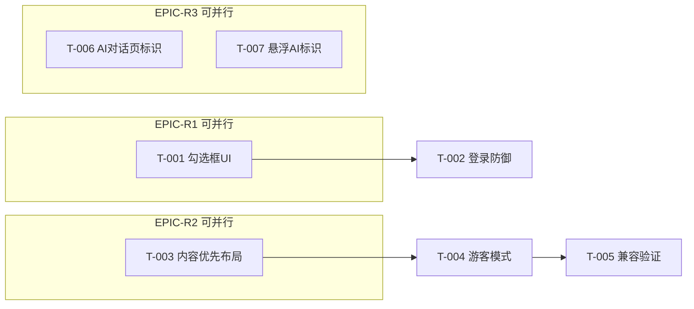

# 任务列表 (Task Breakdown) — 审核拒绝三项整改

## Epic 概览

| Epic | 标题 | Story Points | 优先级 | 依赖 |
|------|------|:--:|:--:|------|
| EPIC-R1 | 隐私政策主动同意 | 3 | P0 | - |
| EPIC-R2 | 首页内容优先+游客模式 | 5 | P0 | - |
| EPIC-R3 | AI生成内容标识 | 3 | P0 | - |

**总Story Points**: 11 | **预计工时**: 并行开发 0.5天，串联 1天

---

## EPIC-R1: 隐私政策主动同意 [3 SP]

### T-001: 首页添加隐私协议勾选框及交互 [2 SP]
**优先级**: P0 | **依赖**: 无
**描述**: 在`pages/home/home.wxml`登录区域上方添加勾选框，用户点击勾选后登录按钮才可用。包含勾选框样式、协议链接可点击。
**验收标准**:
- [ ] 未勾选时登录按钮置灰(disabled=true)，点击无效
- [ ] 勾选后登录按钮变为蓝色可点击
- [ ] 点击《隐私政策》跳转至隐私中心页面
- [ ] 点击《用户服务协议》跳转至关于页面（或服务协议页）
- [ ] 样式与现有Design System一致
**涉及文件**: `pages/home/home.wxml`, `pages/home/home.wxss`

### T-002: 登录Handler添加防御性consent检查 [1 SP]
**优先级**: P0 | **依赖**: T-001
**描述**: 在`handleLogin`方法首行添加`consentChecked`检查，防止DevTools绕过WXML disabled属性。
**验收标准**:
- [ ] consentChecked=false时，调用handleLogin → showToast提示 → return
- [ ] consentChecked=true时，正常执行登录流程
**涉及文件**: `pages/home/home.js`

---

## EPIC-R2: 首页内容优先+游客模式 [5 SP]

### T-003: 首页UI重构为内容优先布局 [2 SP]
**优先级**: P0 | **依赖**: 无（与T-001并行）
**描述**: 重构首页欢迎页布局：三特性卡片作为主体内容，"开始体验·无需登录"作为主操作按钮，登录区通过分隔线降级为次要入口。
**验收标准**:
- [ ] 用户第一屏看到三特性卡片(隐私至上/合规准确/好用高效)
- [ ] "开始体验·无需登录"按钮位置在登录区上方，视觉权重高于登录按钮
- [ ] 分隔线文案"登录解锁全部功能"明确提示登录是可选的
- [ ] 登录按钮视觉权重低于体验按钮
**涉及文件**: `pages/home/home.wxml`, `pages/home/home.wxss`

### T-004: 游客模式入口与全局标记 [2 SP]
**优先级**: P0 | **依赖**: T-003
**描述**: 实现`enterAsGuest()`方法，设置`app.globalData.isGuest = true`并跳转到攻略书Tab。各Tab页在需要登录的功能处检查游客态并提供引导。
**验收标准**:
- [ ] 点击"开始体验"→ 跳转攻略书Tab，不弹登录
- [ ] 游客可在4个Tab页间自由切换
- [ ] 游客访问需登录功能时弹出引导（非阻断）
- [ ] 游客不写Storage，仅内存操作
**涉及文件**: `pages/home/home.js`, 各Tab页按需检查

### T-005: 游客模式各Tab页兼容验证 [1 SP]
**优先级**: P0 | **依赖**: T-004
**描述**: 遍历5个Tab页，确认游客模式下无崩溃、无白屏、无强制登录弹窗。
**验收标准**:
- [ ] 攻略书Tab: 可浏览47篇攻略（_loadAllLocalTasks不依赖登录）
- [ ] 证件夹Tab: 显示空态引导
- [ ] 提醒器Tab: 显示空态引导
- [ ] 流程控Tab: 显示默认流程
- [ ] 我的Tab: 显示未登录引导
**涉及文件**: 无新增代码（验证任务）

---

## EPIC-R3: AI生成内容标识 [3 SP]

### T-006: AI对话页添加AI生成标识 [2 SP]
**优先级**: P0 | **依赖**: 无
**描述**: 在`subpkg-chat/pages/chat/`的AI对话页中，每条AI回复气泡上方添加"AI生成·仅供参考"标签，顶部永久提示增加"本对话内容由人工智能生成"。
**验收标准**:
- [ ] 每条assistant消息气泡显示"AI生成·仅供参考"标签
- [ ] 顶部永久提示包含AI生成声明
- [ ] 标签样式与气泡视觉区分（灰色小字、浅底边框）
- [ ] 不影响消息滚动和键盘弹出
**涉及文件**: `subpkg-chat/pages/chat/index.wxml`, `index.wxss`

### T-007: 悬浮AI组件添加AI生成标识 [1 SP]
**优先级**: P0 | **依赖**: 无（与T-006并行）
**描述**: 在`components/floating-ai/`悬浮AI对话组件中，每条AI回复气泡上方添加同样标识。
**验收标准**:
- [ ] 悬浮AI面板中每条assistant消息显示"AI生成·仅供参考"标签
- [ ] 标签样式与全屏对话页一致
- [ ] 不影响悬浮面板打开/关闭动画
**涉及文件**: `components/floating-ai/floating-ai.wxml`, `floating-ai.wxss`

---

## 依赖关系图

## 里程碑建议

| 里程碑 | 内容 | 预计 |
|--------|------|------|
| M1: 代码完成 | T-001~T-007全部代码修改 | 1天 |
| M2: 自测通过 | Jest 522/522 + 手动走查三项 | 0.5天 |
| M3: 后台配置 | mp后台添加深度合成-AI问答类目 | 人工操作 |
| M4: 提交审核 | 上传新版本+提交审核 | 1次操作 |
