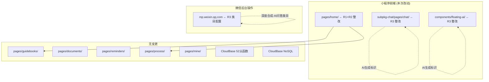
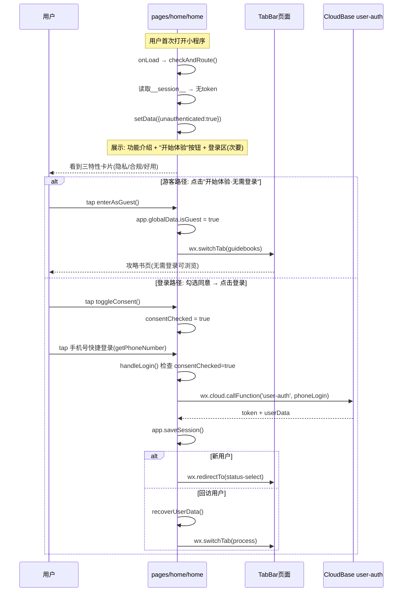
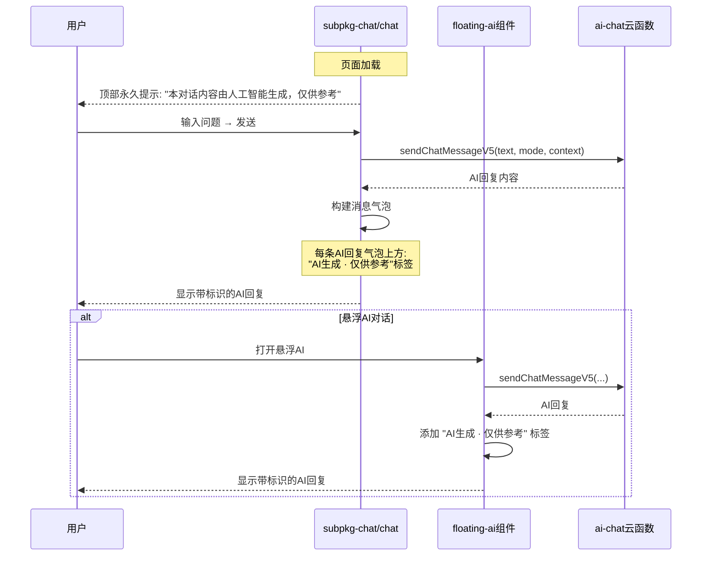

# 技术设计文档 (TDD) — 微信审核拒绝三项整改

## 文档信息
- 项目：住港伴V4.2 微信小程序
- 版本：v1.0
- 设计者：项目技术开发人员
- 日期：2026-05-24
- 关联需求：微信开放平台审核拒绝通知（审核编号 2026-05-24 17:20:49）
- 审核URL：
  - https://developers.weixin.qq.com/community/develop/doc/000ce4a4234cb8bee4c3d28436b009
  - https://developers.weixin.qq.com/community/develop/doc/0008ce8a908108c5d4fee910856c09

---

## 1. 概述

### 1.1 需求背景

住港伴微信小程序V4.2于2026-05-24 17:20:49提交审核，被微信审核团队以三项理由拒绝：

| # | 拒绝原因 | 官方要求 | 严重度 |
|---|---------|---------|:--:|
| R1 | 隐私政策不合规，默认自动同意《用户服务协议》及《隐私政策》 | 用户自主阅读后自行选择是否同意，不得默认强制同意 | 🔴 P0 |
| R2 | 首页未浏览体验功能服务，即要求授权手机号码 | 先体验功能服务后，再自行选择授权登录 | 🔴 P0 |
| R3 | 涉及文本深度合成技术(AI问答)，缺少类目声明和AI生成标识 | 补充深度合成-AI问答类目，AI生成页面增加显著"AI生成"字样 | 🔴 P0 |

### 1.2 设计思路

三项拒绝均属于**交互合规**问题而非功能性缺陷，整改策略为"最小改动、精准修复"：

- **R1（隐私主动同意）**: 在登录入口增加显式勾选框，按钮在未勾选时置灰不可点击 → 改动范围仅限 `pages/home/`
- **R2（先浏览后登录）**: 重构首页布局，功能特性展示为主体内容，"开始体验·无需登录"作为主操作按钮，登录降级为次要入口 → 改动范围 `pages/home/`，下游Page需确保游客模式不崩溃
- **R3（AI生成标识）**: 在AI对话页和悬浮AI组件的每条AI回复上添加"AI生成·仅供参考"标签 → 改动范围 `subpkg-chat/pages/chat/` + `components/floating-ai/`

方案选择理由：三项整改互不交叉，可并行开发。不改动数据模型、API接口、云函数。仅前端UI层变更 + 微信后台类目配置。

### 1.3 非功能需求

| 维度 | 目标 | 衡量标准 |
|------|------|----------|
| 性能 | 无新增性能开销 | 首页渲染时间与整改前持平（<1s） |
| 兼容性 | 不影响已登录用户路由 | 回访用户 → process tab，新用户 → status-select 逻辑不变 |
| 可回归 | 改动可被现有测试覆盖 | Jest 522/522 不降 |
| 合规 | 通过微信审核 | 三项拒绝原因全部修复 |

---

## 2. 技术栈分析

本次整改不引入新技术。全部使用现有技术栈：

| 层面 | 技术 | 版本 | 使用原因 |
|------|------|------|----------|
| 小程序框架 | Taro/原生 | 3.x | 现有项目基础 |
| 页面渲染 | WXML + WXSS | — | 微信小程序标准 |
| 状态管理 | Page data + app.globalData | — | 现有方案，无需引入状态库 |
| 路由 | wx.switchTab / wx.redirectTo / wx.navigateTo | — | 小程序原生API |
| 云函数 | CloudBase | Node18.15 | 已有52个云函数，无变更 |
| 样式 | CSS Variables (var(--blue)等) | — | 现有Design System |

**不选方案及原因：**
| 候选方案 | 不选原因 |
|----------|----------|
| 引入第三方隐私弹窗组件 | 过度工程化，自建勾选框代码量<20行 |
| 将首页改为Tab页 | 会破坏现有路由分发逻辑（home.js checkAndRoute） |
| 使用微信原生隐私弹窗API | 该API需在后台配置且交互不可控，自建更灵活 |

---

## 3. 系统架构 — 改动影响面



### 架构关键决策 (ADR)

#### ADR-001: 首页不改为Tab页，保持路由分发角色
**背景**: 审核要求"先浏览后登录"，最激进方案是将首页改为内容Tab页
**决策**: 保持 `pages/home/home` 为入口，但重构其UI为"功能展示优先+登录次要"
**理由**: 首页 `checkAndRoute()` 承担已登录用户路由分发（新用户→status-select，回访→process tab），改为Tab页会破坏此逻辑。重构UI即可满足审核要求
**权衡**: 首页仍为入口页，但用户看到的不再是登录门禁而是功能介绍+体验入口

#### ADR-002: 游客模式使用app.globalData.isGuest标记，不写云函数
**背景**: 游客浏览时需要区分游客和登录用户
**决策**: 在 `app.globalData` 中设置 `isGuest = true`，各Page按需判断
**理由**: 纯前端标记，无网络开销，不修改52个现有云函数
**权衡**: 游客数据无法持久化到云端，但满足"先浏览"需求

#### ADR-003: AI标识使用内联标签而非Modal弹窗
**背景**: 审核要求"AI生成页面增加显著说明"
**决策**: 每条AI回复气泡上方添加 `AI生成 · 仅供参考` 内联标签
**理由**: 不打断用户阅读流，每条消息都标注比页面级弹窗更严格合规
**权衡**: 增加约2rpx高度的UI空间，视觉负担可忽略

---

## 4. 核心流程与时序图

### 4.1 R1+R2: 首页游客浏览 → 隐私同意 → 登录流程



### 4.2 R3: AI对话页AI生成标识展示



### 4.3 关键状态机 — 首页登录态判断

```
┌──────────┐   无token   ┌──────────────┐
│  onLoad  │ ─────────→ │ unauthenticated│
└──────────┘            │ (展示欢迎页)   │
     │                  └───────┬────────┘
     │ 有token                  │
     │                    ┌─────┼─────┐
     ▼                    │           │
┌──────────┐       游客体验    手机号登录
│ isLocked?│       (guest)   (phoneLogin)
└────┬─────┘         │           │
  Y  │  N           ▼           ▼
     │  │      TabBar页面    success →
     │  │                   setSession
     ▼  │                       │
┌─────────┐              ┌──────┼──────┐
│ paywall │              │              │
└─────────┘          isNew?         !isNew
                        │              │
                        ▼              ▼
                  status-select    process tab
```

---

## 5. 数据模型

本次整改**无数据库变更**。仅涉及前端状态扩展：

### 5.1 Page Data 扩展 — pages/home/home

| 字段 | 类型 | 默认值 | 说明 |
|------|------|--------|------|
| consentChecked | Boolean | false | 用户是否主动勾选同意隐私协议（新增） |

### 5.2 GlobalData 扩展 — app.js

| 字段 | 类型 | 默认值 | 说明 |
|------|------|--------|------|
| isGuest | Boolean | false | 当前是否为游客模式（新增） |

### 5.3 无新增存储Key

游客模式下不写Storage，所有游客浏览数据仅存内存。登录后由recovery engine从云端恢复。

---

## 6. API 接口定义

**本次整改无新增API接口。** 所有接口保持不变：

| 接口 | 方法 | 说明 | 变更 |
|------|------|------|:--:|
| user-auth (phoneLogin) | CloudFunction | 手机号登录 | 无 |
| ai-chat (sendChatMessageV5) | CloudFunction | AI对话 | 无 |
| rag-search | CloudFunction | RAG检索 | 无 |

---

## 7. 异常处理

### 7.1 异常分类与处理策略

| 异常类型 | 场景 | 处理策略 | 用户感知 |
|----------|------|----------|----------|
| 用户未勾选协议点登录 | consentChecked=false时点击getPhoneNumber | handleLogin第一行检查 → showToast提示 | "请先阅读并同意隐私政策和服务协议" |
| 游客模式进入需登录功能 | 游客点击AI对话/我的页面等 | Page检查isGuest → 引导登录弹窗 | "登录后可享受完整功能" |
| 隐私政策/用户协议页面不存在 | openPrivacyPolicy/openUserAgreement 404 | 降级到about页面 | 显示关于页面 |
| 游客模式Storage读写失败 | 游客无Storage写入权限(预期内) | 仅内存操作，静默 | 无感知 |

### 7.2 游客模式防御策略

各Page需在 `onLoad` / `onShow` 检查游客态：

```
// 防御模式：Page中检查游客状态
if (app.globalData.isGuest && 需要登录的功能) {
  wx.showModal({ title: '登录后可用', confirmText: '去登录', ... });
  return; // 降级，不执行后续逻辑
}
```

### 7.3 登录按钮双重防御

```javascript
// 第一层: WXML disabled属性
<button disabled="{{!consentChecked}}">  // 未勾选时置灰

// 第二层: JS代码防御（防止DevTools绕过disabled）
if (!this.data.consentChecked) {
  wx.showToast({ title: '请先阅读并同意隐私政策和服务协议' });
  return;
}
```

---

## 8. 对下游影响分析

### 8.1 影响范围

| 下游模块 | 影响类型 | 影响说明 | 是否需配合变更 |
|----------|----------|----------|:--:|
| pages/guidebooks/ | 游客访问 | 游客可浏览攻略书内容（已有fallback） | 否 |
| pages/documents/ | 游客访问 | 游客无证件数据（已有空态处理） | 否 |
| pages/reminders/ | 游客访问 | 游客无提醒数据（已有空态处理） | 否 |
| pages/process/ | 游客访问 | 游客无流程数据（已有空态处理） | 否 |
| pages/mine/ | 游客访问 | 游客显示未登录引导 | 否 |
| components/floating-ai/ | UI变更 | 增加AI标识，功能不变 | 否 |
| 52个云函数 | 无影响 | 无接口变更 | 否 |
| CloudBase NoSQL | 无影响 | 无Schema变更 | 否 |
| 微信后台配置 | 需操作 | 补充深度合成-AI问答类目 | 是（人工） |

### 8.2 无数据迁移

本次整改不涉及数据库Schema变更，无需数据迁移。

---

## 9. 安全设计

| 检查项 | 状态 | 说明 |
|--------|:--:|------|
| 登录防御 | ✅ | 双重防御（WXML disabled + JS guard） |
| 隐私协议链接 | ✅ | 可点击查看，不默认同意 |
| 游客Token泄露 | ✅ | 游客不写token到Storage |
| AI标识绕过 | — | 纯前端标签，无安全风险 |
| XSS | ✅ | rich-text节点已做sanitize |
| 依赖CVE | ✅ | 无新增依赖 |

---

## 10. 可观测性设计

### 10.1 关键埋点（建议新增）

| 事件 | 触发时机 | 用途 |
|------|----------|------|
| `home_guest_enter` | 用户点击"开始体验·无需登录" | 统计游客转化率 |
| `home_consent_toggle` | 用户勾选/取消隐私同意 | 统计同意率 |
| `home_login_phone` | 手机号登录成功 | 统计登录转化率 |
| `ai_label_view` | AI标识曝光 | 合规审计 |

### 10.2 现有监控不降

- Jest 522/522 测试必须全绿
- 首页渲染时间 <1s
- 无新增console.error

---

## 11. 部署架构

### 11.1 部署步骤

```
1. 代码修改 → 7文件（WXML/JS/WXSS）
2. git commit + push
3. 微信开发者工具 → 上传代码
4. mp.weixin.qq.com → 设置 → 服务类目 → 添加"深度合成-AI问答"
5. 提交审核
```

### 11.2 回滚方案

- 回退到commit `2fcaa99`（审核版本，已通过功能验证）
- 类目配置不影响回滚

---

## 12. 附录

### A. 修改文件清单

| 文件 | 修改行数 | 整改项 |
|------|:--:|:--:|
| pages/home/home.wxml | +25/-10 | R1+R2 |
| pages/home/home.js | +22/-0 | R1+R2 |
| pages/home/home.wxss | +54/-4 | R1+R2 |
| subpkg-chat/pages/chat/index.wxml | +8/-2 | R3 |
| subpkg-chat/pages/chat/index.wxss | +15/-0 | R3 |
| components/floating-ai/floating-ai.wxml | +5/-0 | R3 |
| components/floating-ai/floating-ai.wxss | +11/-0 | R3 |
| **合计** | **+140/-16** | — |

### B. 微信审核官方参考
- 小程序用户隐私保护指引常见问题
- 先体验后授权规范（微信开放社区 2025-2026）
- 《人工智能生成合成内容标识办法》（国信办通字〔2025〕2号，2025-09-01施行）

### C. 关键检查项（提审前验证）

- [ ] 首页显示三特性卡片 + "开始体验"按钮
- [ ] 勾选框未勾选时登录按钮置灰不可点击
- [ ] 点击隐私政策/用户协议可跳转查看
- [ ] 游客模式可浏览TabBar全部页面
- [ ] 游客点击需登录功能时弹出引导
- [ ] AI对话页每条AI回复显示"AI生成·仅供参考"
- [ ] 悬浮AI每条回复显示相同标识
- [ ] mp后台已添加深度合成-AI问答类目
