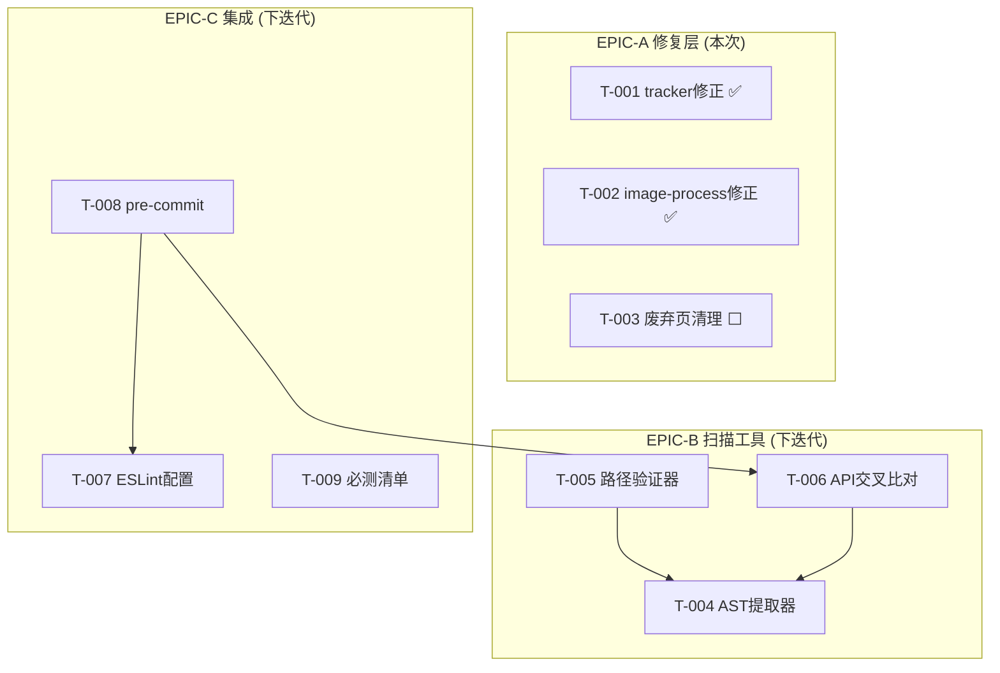

# 任务列表 (Task Breakdown) — 预存缺陷治理专项

## Epic概览

| Epic | 标题 | SP | 优先级 | 依赖 | 状态 |
|------|------|:--:|:--:|------|:--:|
| EPIC-A | 修复层：已发现缺陷修复 | 3 | P0 | - | 🟢 3/4完成 |
| EPIC-B | 预防层：audit-requires扫描工具 | 8 | P1 | EPIC-A | ⬜ |
| EPIC-C | 预防层：ESLint + Hook集成 | 5 | P1 | EPIC-B | ⬜ |

总SP: 16 | 工期: A 0.2天(已完成), B+C 2天(下迭代)

---

## EPIC-A: 修复层 [3 SP]

### T-001: tracker API名称修正 [1 SP] ✅
**优先级**: P0 | **依赖**: 无 | **状态**: f414e07
**描述**: 3处 `tracker.track()` → `tracker.event()`
**验收**: 真机验证新建流程不崩溃

### T-002: image-process路径修正 [1 SP] ✅
**优先级**: P0 | **依赖**: 无 | **状态**: 5981268
**描述**: documents-add/index.js:334 require路径3层→2层
**验收**: 真机验证证件裁剪不崩溃

### T-003: 废弃攻略详情页清理 [1 SP] ⬜
**优先级**: P2 | **依赖**: 无
**描述**: 删除 `subpkg-guide/pages/guidebooks-detail/` 目录，移除 app.json 注册
**验收**: 编译通过 + `git grep guidebooks-detail` 无引用

---

## EPIC-B: 预防层 — 扫描工具 [8 SP]

### T-004: AST require提取器 [3 SP]
**优先级**: P1 | **依赖**: 无
**描述**: 实现 `scripts/audit-requires.js` 核心逻辑：AST解析 → 收集require调用 → 提取本地变量名
**验收**:
- [ ] 正确解析 `const x = require('./foo')` 
- [ ] 正确解析解构 `const { a, b } = require('./foo')`
- [ ] 忽略注释中的require字符串
- [ ] 跳过 `node_modules/` 和 `coverage/`

### T-005: 路径存在性验证器 [2 SP]
**优先级**: P1 | **依赖**: T-004
**描述**: 对每个require路径计算绝对路径 → fs.existsSync验证 → 输出MODULE_NOT_FOUND报告
**验收**:
- [ ] 发现 `require('../../../utils/image-process')` 错误
- [ ] 发现 `require('../../../data/guidebook-data')` 不存在
- [ ] 正确处理 `require('./foo')` 相对路径和 `require('@/utils/foo')` 别名

### T-006: module.exports API交叉比对 [3 SP]
**优先级**: P1 | **依赖**: T-004
**描述**: 解析目标模块的module.exports → 收集导出方法列表 → 与调用方的方法调用交叉比对
**验收**:
- [ ] 发现 `tracker.track()` 不存在（tracker仅导出event/pageView/setReferrer）
- [ ] 正确处理 `module.exports = { a, b }` 和 `module.exports.a = ...` 两种导出模式
- [ ] 正确处理 `module.exports = function` (导出为default)
- [ ] 无误报：验证 storage.js 20+方法全部匹配

---

## EPIC-C: 预防层 — 集成 [5 SP]

### T-007: ESLint规则配置 [2 SP]
**优先级**: P1 | **依赖**: 无
**描述**: 安装 `eslint-plugin-node`，启用 `node/no-missing-require: error`，启用 `import/no-unresolved: warn`
**验收**:
- [ ] `npm run lint` 通过
- [ ] 人为引入错误require路径 → lint报错

### T-008: pre-commit hook集成 [2 SP]
**优先级**: P1 | **依赖**: T-006, T-007
**描述**: 在 `.husky/pre-commit` 中追加 `npm run audit:requires && npm run lint`
**验收**:
- [ ] `git commit` 时自动执行扫描
- [ ] 发现缺陷时阻断提交（exit code 1）
- [ ] `git commit --no-verify` 可跳过

### T-009: 真机必测清单更新 [1 SP]
**优先级**: P1 | **依赖**: 无
**描述**: 在 `wechat-miniprogram-upload-checklist` 技能中增加3项必测场景
**验收**:
- [ ] 文档中包含：新建流程→选路径、自评→选路径、证件→裁剪确认

---

## 依赖关系图

## 里程碑

| 里程碑 | 内容 | SP | 状态 |
|--------|------|:--:|:--:|
| M1: 修复完成 | T-001 + T-002 + T-003 | 3 | 🟢 2/3 |
| M2: 工具可用 | T-004 + T-005 + T-006 | 8 | ⬜ |
| M3: 系统集成 | T-007 + T-008 + T-009 | 5 | ⬜ |
