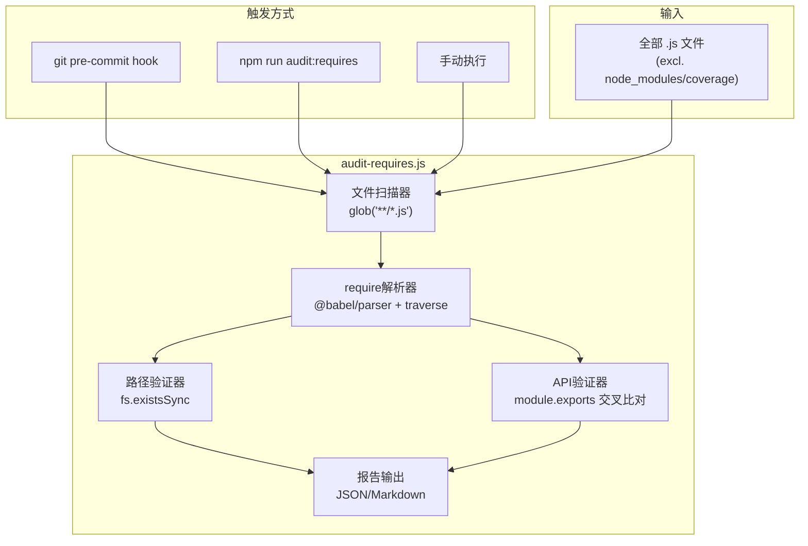
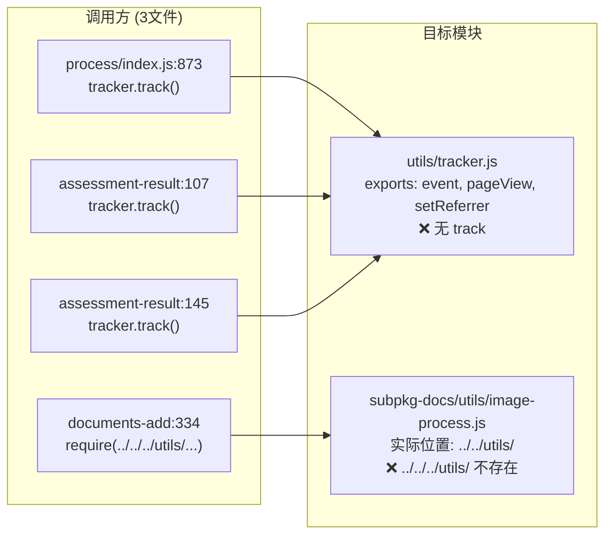
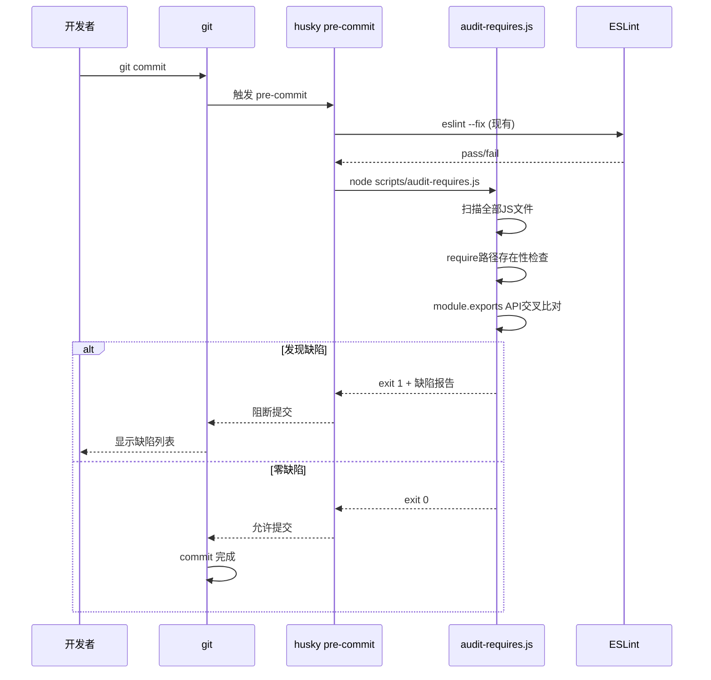

# 技术设计文档 (TDD) — 预存缺陷治理专项

## 文档信息
- 项目：住港伴V4.2 预存缺陷治理
- 版本：v1.0
- 设计者：项目技术开发人员
- 日期：2026-05-25
- 关联PRD：预存缺陷专项_产品需求文档_PRD_v1.0.md

---

## 1. 概述

### 1.1 项目背景

2026-05-25真机测试暴露 `tracker.track is not a function` 崩溃。根因为 `utils/tracker.js` 仅导出 `event/pageView/setReferrer`，但 `pages/process/index/index.js` 和 `subpkg-low/pages/assessment-result/index.js` 调用了不存在的 `track()` 方法。全项目扫描发现同类缺陷4项，共同特征：**代码写入了但执行路径从未触发，Lint/Jest/常规真机测试均无法捕获**。

### 1.2 设计思路

分两层治理：
- **修复层（方案A）**：逐项修复已发现的4项缺陷，代码量极小（5行修改 + 1页删除）
- **预防层（方案B）**：构建静态扫描工具 `audit-requires.js`，在CI/pre-commit阶段自动检测 require路径不存在 和 模块API不匹配 两类缺陷

方案A为本次迭代立即执行；方案B为下迭代基础设施。

### 1.3 非功能需求

| 维度 | 目标 | 衡量标准 |
|------|------|----------|
| 性能 | audit-requires.js 扫描耗时 <5s | 全项目51个JS文件 |
| 可用性 | pre-commit不增加显著等待 | <3s 增量扫描 |
| 准确性 | 零误报 | 仅报告确认为缺陷的项 |
| 可扩展 | 支持新增检测规则 | plugin架构预留 |

---

## 2. 技术栈分析

### 2.1 修复层

| 层面 | 技术 | 理由 |
|------|------|------|
| tracker修复 | 纯文本替换 `track`→`event` | 不改变调用语义，仅修正API名称 |
| image-process修复 | 纯文本修正require路径 | 同文件已有正确路径可参照 |
| 废弃页清理 | git rm + app.json编辑 | 删除已标记@deprecated的页面 |

### 2.2 预防层

| 层面 | 技术 | 理由 |
|------|------|------|
| 扫描引擎 | Node.js (CommonJS) | 项目已有Node环境，无需额外依赖 |
| AST解析 | `@babel/parser` + `@babel/traverse` | 精确解析require调用和export，避免正则误判 |
| ESLint规则 | `eslint-plugin-import` + `eslint-plugin-node` | 社区成熟方案，配置即用 |
| Hook | husky pre-commit | 项目已有husky配置 |
| CI | GitHub Actions / 本地脚本 | `npm run audit:requires` |

### 不选方案

| 候选方案 | 不选原因 |
|----------|----------|
| TypeScript迁移 | 项目体量10万+行，迁移成本远超治理收益 |
| Webpack plugin | 仅在构建时生效，不覆盖开发阶段 |
| ESLint自定义规则 | 开发成本高于复用社区plugin + 独立脚本 |

---

## 3. 系统架构

### 3.1 缺陷检测架构



### 3.2 核心算法 — require-export 交叉比对

```
输入: 项目根目录
输出: 缺陷列表 [{ file, line, requirePath, calledMethod, exists, exported }]

对于每个JS文件F:
  1. AST解析 → 收集所有 CallExpression:
       callee.name === 'require' → argument是路径字符串
       记录: { localName, requirePath, line }
  
  2. 对于每个require记录:
     a. 计算requirePath的绝对路径 → fs.existsSync 验证
        不存在 → 报告 "MODULE_NOT_FOUND"
    
     b. 路径存在时 → 解析目标文件的 AST → 提取 module.exports
       - { memberExpression: 'module.exports = { a, b }' } → 收集 'a', 'b'
       - { memberExpression: 'module.exports.a = ...' } → 收集 'a'
       - { memberExpression: 'module.exports = function' } → 收集 'default'
    
     c. 在同文件中搜索 `localName.methodCall()` 调用
       对每个调用的 methodCall 名称 → 在 step-b 的导出列表中查找
       不存在 → 报告 "METHOD_NOT_FOUND"
```

### 3.3 架构关键决策 (ADR)

#### ADR-001: 使用AST解析而非正则
**背景**: require路径和module.exports结构多样化，正则匹配不可靠
**决策**: 使用 `@babel/parser` + `@babel/traverse` 精确解析
**理由**: 避免 `// const x = require('...')` 注释、模板字符串、条件require等边界情况误判
**权衡**: 引入2个npm依赖（parser + traverse），增加~3MB node_modules

#### ADR-002: 独立脚本 + ESLint双轨
**背景**: 路径检测和API检测是两类不同问题
**决策**: ESLint handle路径问题（成熟），独立脚本handle API匹配（无现成方案）
**理由**: 避免重复造eslint-plugin级别的轮子；API交叉比对的逻辑与eslint visitor模式不匹配
**权衡**: 维护两条检测链路，但总代码量 <200行

#### ADR-003: 错误时阻断提交但支持 `--no-verify` 跳过
**背景**: pre-commit阻断可能影响紧急hotfix流程
**决策**: 默认阻断（exit code 1），支持 `git commit --no-verify` 跳过
**理由**: 正常开发流程强制检查，紧急情况保留逃生通道
**权衡**: 可能被滥用跳过，但比完全不做检查强

---

## 4. 核心流程

### 4.1 修复层 — 修改点数据流



### 4.2 预防层 — pre-commit 流程



---

## 5. 数据模型

### 5.1 缺陷报告数据模型

```
Defect {
  file: string         // 文件路径 (相对于项目根目录)
  line: number         // 行号
  severity: 'error' | 'warning'
  type: 'MODULE_NOT_FOUND' | 'METHOD_NOT_FOUND' | 'UNUSED_REQUIRE'
  requirePath: string  // require() 的路径参数
  localName: string    // require 赋值的变量名
  method?: string      // 调用但不存在的method名 (仅METHOD_NOT_FOUND)
  exportedMethods?: string[] // 模块实际导出的方法列表 (仅METHOD_NOT_FOUND)
  suggestion?: string  // 修复建议
}
```

### 5.2 不需要数据库

`audit-requires.js` 是纯CLI工具，输出JSON/Markdown到stdout或文件。不涉及持久化。

---

## 6. 命令行接口定义

### audit-requires.js

```
用法: node scripts/audit-requires.js [options]

Options:
  --format <json|md>     输出格式 (默认: md)
  --output <path>        输出到文件 (默认: stdout)
  --severity <level>     最低报告级别 (默认: error)
  --changed-only         仅检查git diff中的变更文件
  --help                 帮助信息

退出码:
  0  零缺陷
  1  发现缺陷

示例:
  node scripts/audit-requires.js --format json --output report.json
  node scripts/audit-requires.js --changed-only  # pre-commit 快速模式
```

---

## 7. 异常处理

### 7.1 扫描异常

| 异常 | 处理 |
|------|------|
| AST解析失败（语法错误文件） | 跳过该文件，stderr输出警告，不阻塞 |
| 模块路径解析为目录（如 `require('./utils')`） | 尝试 `index.js` 后缀，不存在则报告 |
| 循环依赖 | 不处理（超出本次范围），不报告 |
| `module.exports` 动态赋值（如 `exports[key] = `） | 标记为 uncertain，降级为 warning |

### 7.2 ESLint降级

`import/no-unresolved` 在某些路径别名场景可能误报。初期仅启用 `node/no-missing-require`，`import/no-unresolved` 作为warn而非error。

---

## 8. 下游影响

| 下游模块 | 影响 | 说明 |
|----------|:--:|------|
| tracker修复 | 无 | `event()` 的参数签名与 `track()` 完全相同，语义不变 |
| image-process修复 | 无 | 路径修正后模块加载行为与238、297行已存在的正确调用一致 |
| 废弃页清理 | 无 | 页面已标记@deprecated且不可达 |
| audit-requires.js | 无 | 纯新增文件，不修改现有代码 |
| ESLint配置 | 低 | 新增规则，可能暴露现有文件的lint warning |

---

## 9. 安全设计

不涉及安全变更。audit-requires.js 仅读取文件系统，无网络调用，无用户输入。

---

## 10. 可观测性

| 检测层 | 触发时机 | 输出 |
|--------|----------|------|
| pre-commit | 每次git commit | 阻断/通过 + 缺陷列表 |
| CI | 每次push | JSON报告归档 |
| 手动 | 开发调试 | stdout Markdown表格 |
